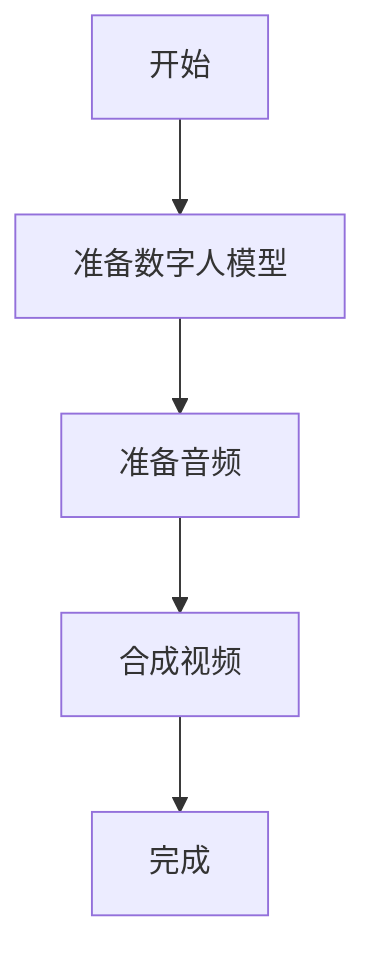
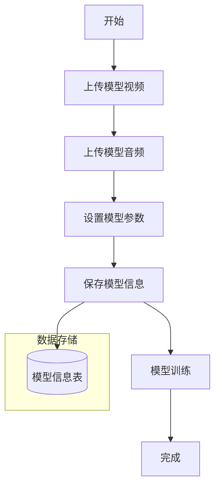
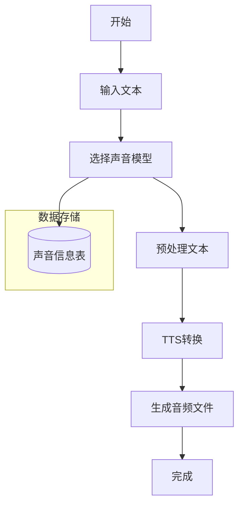
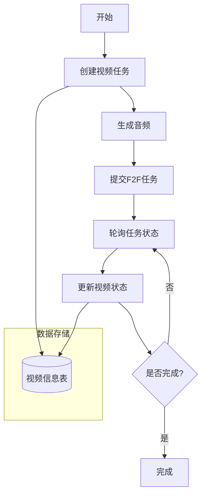
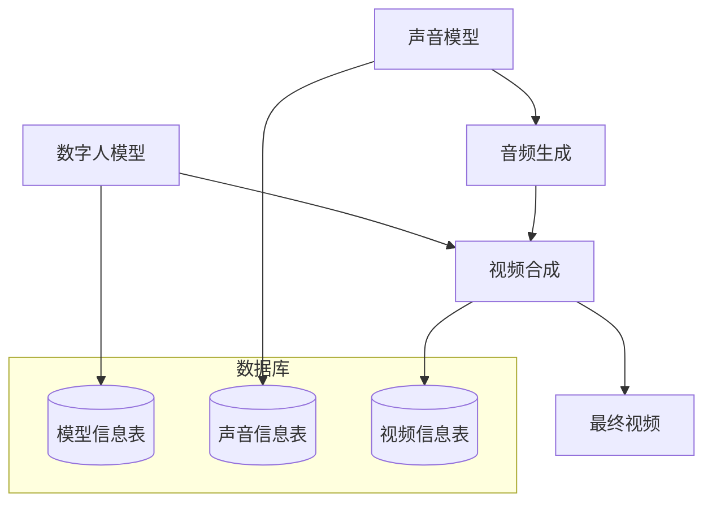

# 数字人视频制作核心逻辑流程

## 1. 整体流程概述

## 2. 数字人模型制作流程

## 3. 声音合成流程

## 4. 视频合成流程

## 5. 数据流转关系

## 6. 核心API调用流程

### 6.1 视频合成API
- `makeVideo(param)`: 提交视频制作任务
- `getVideoStatus(taskCode)`: 查询视频制作任务状态

### 6.2 音频合成API
- `makeAudio(param)`: 生成音频文件
- `preprocessAndTran(param)`: 预处理和转换音频

## 7. 状态管理

### 7.1 视频状态
- 待处理
- 处理中
- 已完成
- 失败

### 7.2 处理流程
1. 创建视频任务，初始状态为"待处理"
2. 系统定期检查待处理任务
3. 开始处理时更新状态为"处理中"
4. 处理完成后更新状态为"已完成"或"失败"

## 8. 文件管理

### 8.1 音频文件
- 原始音频文件
- 预处理后的音频文件
- 生成的TTS音频文件

### 8.2 视频文件
- 模型训练视频
- 生成的数字人视频
- 最终合成视频

## 9. 注意事项

1. 模型制作
   - 确保模型视频质量
   - 保证音频清晰度
   - 正确设置模型参数

2. 音频处理
   - 文本预处理
   - 音频格式转换
   - 音频质量控制

3. 视频合成
   - 任务状态监控
   - 错误处理机制
   - 资源清理

4. 数据管理
   - 定期数据备份
   - 文件存储管理
   - 状态同步维护